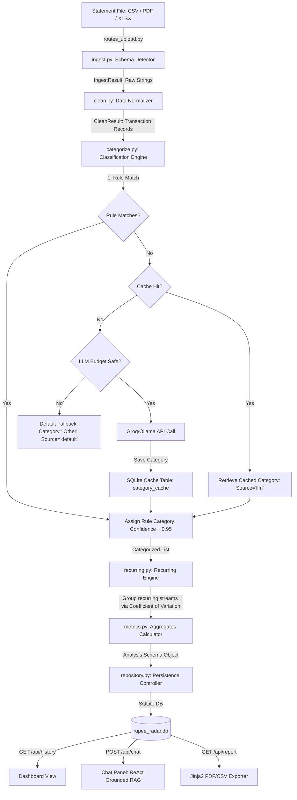

# RupeeRadar — Comprehensive Project & Interview Guide

This guide provides an end-to-end technical breakdown of **RupeeRadar**, mapping out its architectural components, processing pipelines, underlying mathematical concepts, tech stack, and typical interview questions/answers to help you explain the project perfectly.

---

## 1. System Architecture Diagram

Below is the conceptual flow of the system, from bank statement upload to visual reporting, database persistence, token budget auditing, and conversational chat RAG routing.

---

## 2. Technology Stack

The project is designed with a lightweight, local-first footprint that enables quick execution, high data privacy, and a low memory overhead.

### Backend (Python)
*   **Web Framework:** FastAPI (async endpoints, dependency injection settings, CORS middleware).
*   **Data Science & Ingestion:** Pandas (tabular conversions, grouping data), OpenPyXL (Excel file reader), PDFPlumber (PDF text extraction and table scraping).
*   **Database Interface:** Python Standard `sqlite3` with raw SQL queries. Context managers for connection pool safety.
*   **HTTP Client:** `httpx` (async/sync requests to Groq/Ollama endpoints).
*   **Templating:** Jinja2 (HTML print report layouts).
*   **PDF Compiler:** WeasyPrint (HTML-to-PDF compilation via best-effort OS bindings).
*   **Testing:** Pytest (114 assertions verifying budgets, schemas, routing, and pipelines).

### Frontend (React + TypeScript)
*   **Build Tooling & Server:** Vite (fast compilation, hot reloading).
*   **Styling:** Tailwind CSS (responsive layouts, modern SaaS aesthetic, custom graticule dividers).
*   **Data Visualizations:** Recharts (responsive horizontal bar charts, clean SVG legends).
*   **Type Safety:** TypeScript (mirrors backend database schemas recursively).

---

## 3. Data Processing Pipeline (Step-by-Step)

### Step 1: Multi-Format Ingestion (`ingest.py`)
1.  **Format Dispatch:** The upload endpoint inspects the file extension.
    *   **CSV:** Standard `pandas.read_csv`.
    *   **Excel (.xlsx):** `pandas.read_excel` using the `openpyxl` engine.
    *   **PDF (.pdf):** `pdfplumber` attempts to extract tables first. If tables are absent or headers cannot be matched, it falls back to a **line-by-line regex scanner** looking for dates and decimal patterns.
2.  **Schema Auto-Detection:** Maps source file headers to standard ledger fields (`date`, `description`, `amount`, `debit`, `credit`, `balance`) by scoring header names against synonyms (e.g., `narration` or `particulars` $\rightarrow$ `description`).

### Step 2: Cleaning & Normalization (`clean.py`)
1.  **Date Parsing:** Interprets multiple string date structures (e.g. `DD/MM/YYYY`, `YYYY-MM-DD`, `DD-MMM-YYYY`) into ISO standard date strings.
2.  **Amount Reconciliation:** Strips currency symbols (₹), commas, brackets, and ledger suffixes (`Cr`, `Dr`). If the file has separate `debit` and `credit` columns, it normalizes them into a single absolute `amount` and a `direction` key (`debit` / `credit`).
3.  **Description Scrubbing:** Discards payment rail markers (UPI, IMPS, RTGS), transaction references (ref numbers, transaction IDs), and mobile VPAs. This turns a messy description like `UPI/ZOMATO-PAY/129384729/Payment from phone` into a clean merchant token like `"ZOMATO"`.

### Step 3: Classification Engine (`categorize.py`)
To satisfy a **frugal token discipline** (minimizing LLM API costs), classification runs in a three-pass system:
1.  **First Pass (Deterministic Rules):** Scans the clean merchant token against compiled keyword rules (e.g. `ZOMATO`/`SWIGGY` $\rightarrow$ `Food`, `HDFC HOME LOAN` $\rightarrow$ `EMI`). Sets `category_source = "rule"`.
2.  **Second Pass (SQLite Cache):** If no rule matches, it checks a local SQLite cache table (`category_cache`). If a matching clean merchant has been classified by the LLM in the past, it retrieves it. Sets `category_source = "llm"`.
3.  **Third Pass (LLM Fallback):** Unmatched merchant descriptions are batched (up to 15 items) and sent to the LLM (Groq or local Ollama). Once the LLM responds, the category is validated against a canonical set, saved to the SQLite cache, and returned. Sets `category_source = "llm"`. If rate limits are breached or LLM is offline, it gracefully falls back to `"Other"` (`category_source = "default"`).

### Step 4: Recurring Stream Detection (`recurring.py`)
Identifies recurring debits (subscriptions, rent, utilities) using mathematical stability checks:
1.  **Grouping:** Debits are grouped by clean merchant.
2.  **Variance Filtering (Coefficient of Variation):** Calculates stability of transaction amounts.
    $$\text{Coefficient of Variation (CoV)} = \frac{\sigma}{\mu} = \frac{\text{Standard Deviation}}{\text{Mean}}$$
    A stream is recurring if amount variation is small ($\text{CoV} \le 0.15$).
3.  **Interval Analysis:** Gaps in transaction dates are sorted and analyzed to classify the interval cadence:
    *   $6 - 8$ days $\rightarrow$ `weekly`
    *   $27 - 32$ days $\rightarrow$ `monthly`
    *   $80 - 100$ days $\rightarrow$ `quarterly`
    *   $350 - 380$ days $\rightarrow$ `yearly`
    *   Otherwise $\rightarrow$ `irregular`

### Step 5: Metrics Aggregations (`metrics.py`)
Computes essential ledger metrics:
*   `total_income` & `total_spend`
*   `net_savings` & `savings_rate` (Savings / Income)
*   Top categories (sorted descending by aggregate spending)
*   Largest single expense item.

---

## 4. LLM Token Budget Guard & Chat RAG

### Token Budget Guard (`budget.py`)
To prevent infinite loops or cost spikes on the free tier, a rolling SQLite logger tracks all token usage.
1.  **Pre-Flight Checking (`would_exceed`):** Before making an API request, it calculates the rolling usage for:
    *   RPM (Requests Per Minute): Cap is 30.
    *   TPM (Tokens Per Minute): Cap is 1,000.
    *   RPD (Requests Per Day): Cap is 12,000.
    *   TPD (Tokens Per Day): Cap is 100,000.
2.  **Degradation:** If a limit is breached, requests are temporarily blocked. The backend calculates the remaining backoff duration via `get_retry_after()` and instructs the frontend. The dashboard degrades gracefully (using deterministic templates), and the Chat shows an offline indicator.

### Grounded Conversational Chat RAG (`chat.py` & `tools.py`)
The chat bot is grounded in your uploaded data using a custom **ReAct (Reasoning and Action) loop**:
1.  **Tool Selection Prompt:** When a user types a query, the LLM is prompted with the query and available tool definitions. It returns a JSON command selecting a tool (e.g. `search_transactions` with query `"Netflix"`).
2.  **Local Query Execution:** Python maps this string to a database query function, runs it in SQLite, and returns a formatted text context of the transactions.
3.  **Fact-Grounded Formulation:** The context is appended to the prompt, and the LLM formulates a user-friendly answer. This prevents arithmetic hallucinations because the LLM is only summarizing pre-calculated SQL outputs.
4.  **Capped Conversation History:** The chat endpoint loads only the last 6 message turns (3 user + 3 assistant) from SQLite `chat_history` to keep prompt sizes small and prevent TPM breaches.

---

## 5. Database Schema Details

The application uses SQLite (`rupee_radar.db`) with five core tables:

### 1. `analyses`
Holds metadata headers for uploaded statements:
*   `session_id` (TEXT PRIMARY KEY)
*   `created_at` (TEXT)
*   `metrics` (TEXT - JSON blob of computed aggregates)
*   `insights` (TEXT - JSON array of bullet points)
*   `narrative` (TEXT - Monthly written executive briefing)

### 2. `transactions`
List of parsed transactions:
*   `id` (TEXT PRIMARY KEY)
*   `session_id` (TEXT, FOREIGN KEY $\rightarrow$ `analyses`)
*   `date` (TEXT)
*   `description_raw` (TEXT)
*   `description_clean` (TEXT)
*   `amount` (REAL)
*   `direction` (TEXT - `debit` or `credit`)
*   `category` (TEXT)
*   `category_source` (TEXT)
*   `confidence` (REAL)
*   `is_recurring` (INTEGER)

### 3. `recurring_groups`
Identified recurring bill pipelines:
*   `id` (TEXT PRIMARY KEY)
*   `session_id` (TEXT, FOREIGN KEY $\rightarrow$ `analyses`)
*   `merchant` (TEXT)
*   `category` (TEXT)
*   `cadence` (TEXT)
*   `typical_amount` (REAL)
*   `occurrences` (INTEGER)

### 4. `category_cache`
Permanent dictionary mapping merchant names to categories:
*   `merchant` (TEXT PRIMARY KEY)
*   `category` (TEXT)

### 5. `insight_cache`
Saves LLM narrative and polished insights for statement sessions:
*   `cache_key` (TEXT PRIMARY KEY $\rightarrow$ `session_id`)
*   `insights` (TEXT)
*   `narrative` (TEXT)

---

## 6. Typical Interview Questions & Answers

### Q: Why did you choose SQLite over PostgreSQL/MySQL?
> **Answer:** "SQLite was chosen because RupeeRadar is designed as a local-first, privacy-respecting utility. Since bank statements contain highly sensitive personal financial records, we do not want to upload and store data on a centralized cloud database. SQLite stores everything locally in a single file on the client's system. Additionally, SQLite is serverless, has zero deployment overhead, and runs in-process, making the app highly performant and easy to set up."

### Q: How does your uploader handle different columns from different banks?
> **Answer:** "We use a fuzzy schema auto-detection algorithm in `ingest.py`. We defined a synonym dictionary for canonical database columns (e.g. `date`, `description`, `amount`, `debit`, `credit`). When a file is uploaded, we normalize the headers (remove whitespace, special characters, and lowercase them) and score them against the synonym lists. The highest-scoring header is claimed. This allows the pipeline to parse HDFC, ICICI, SBI, and custom statement layouts without requiring custom parsers for each bank."

### Q: How did you implement your LLM RAG chatbot without hit rate limit issues?
> **Answer:** "First, we capped the dialogue history loaded from the SQLite `chat_history` table to the last 6 turns (3 User, 3 Assistant) to minimize prompt token count. Second, we implemented a code-based ReAct loop: instead of feeding all transaction records to the model context, the model first outputs a JSON tool call selection. Python executes that tool locally using optimized SQLite queries (like searching description strings or category groupings), and we only feed the resulting text summary back to the model. This keeps our prompt sizes under 400 tokens and works within the 1,000 TPM limit of Groq's free tier."

### Q: Explain how your application detects subscription items.
> **Answer:** "Subscription detection is implemented in `recurring.py`. We group all debit transactions by their clean merchant name. For groups with multiple transactions, we calculate the Coefficient of Variation (CoV)—which is the standard deviation divided by the mean. If the CoV is less than or equal to 0.15, it indicates that the payment amount is highly stable. We then sort the transaction dates and look at the interval gaps (e.g., ~30 days for monthly cadence). If the cadence matches, we flag it as a recurring stream."
